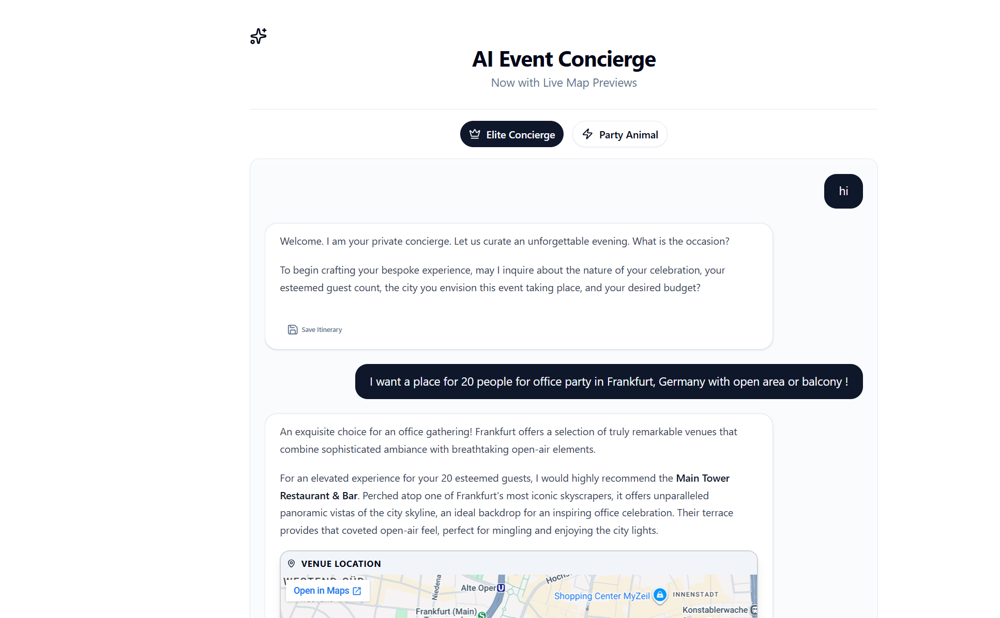
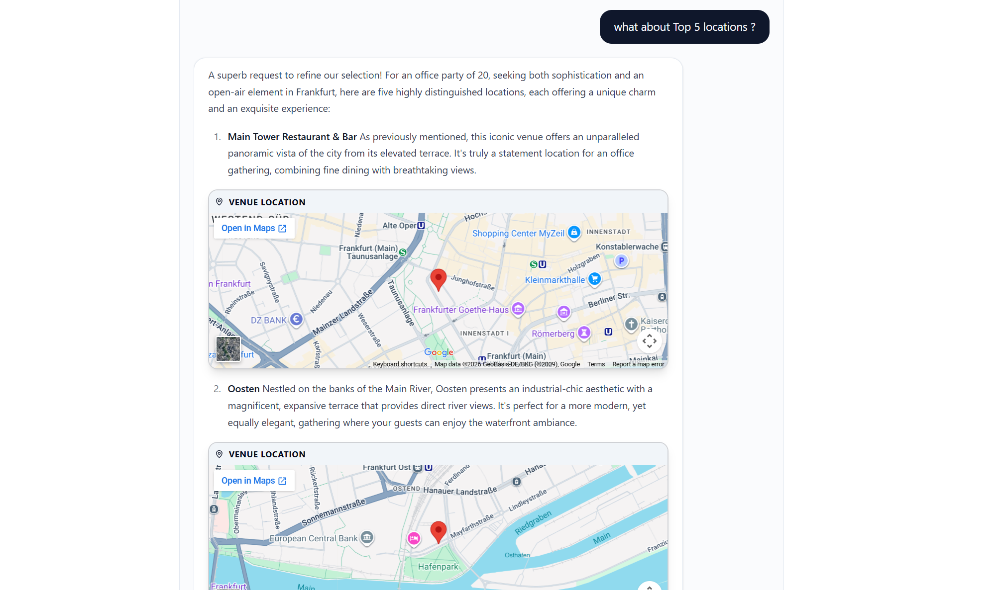
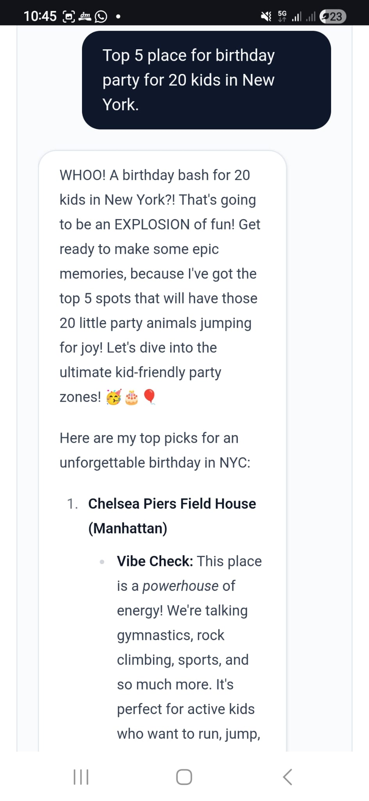
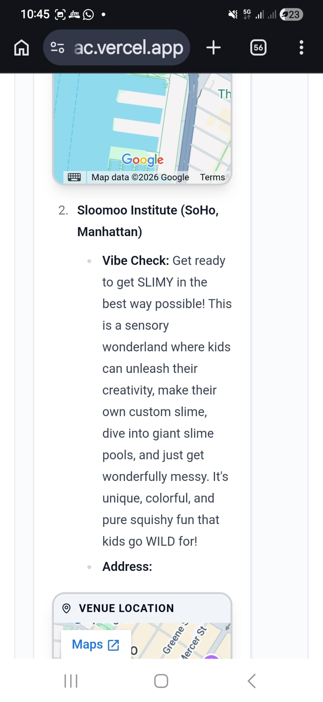
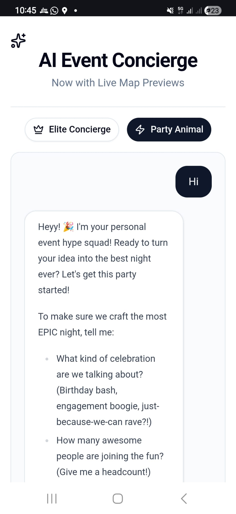

# AI-Powered Event Concierge

Live Demo: https://ai-event-planner-lac.vercel.app/

A modern conversational web application that helps users plan events using natural language.  
Powered by **Next.js**, **Vercel AI SDK** + **Google Gemini API** — extremely fast LLM inference for real-time venue suggestions, plan refinement and event organization.

https://github.com/RiaVirk/AI-Event-Planner

<p align="center">
  
  <br/><br/>
  <em>Describe your event → get smart venue suggestions in seconds</em>
</p>

## ✨ Features

- Natural language event description  
  _“Casual 35-person birthday drinks in Austin, rooftop or patio, max $2800, next month”_
- Extremely fast streaming responses thanks to **Gemini 2.5 Flash** (low latency, often <1s Time-to-First-Token)
- Smart follow-up questions when details are missing
- Venue suggestions with:
  - Name & approximate location
  - Capacity range
  - Estimated price band
  - 1–2 reasons why it matches the request
- Conversational iteration (“cheaper options”, “indoor only”, “add finger food”)
- Responsive design — great experience on mobile & desktop
- Clean, modern UI built with Tailwind CSS + shadcn/ui

## Architecture

User → Next.js Chat UI → API Route → Gemini 2.5 Flash
↓
PostgreSQL (chat history)

Venue data → Google Maps API → Map previews

## ⚡ Why Gemini 2.5 Flash?

Gemini 2.5 Flash delivers some of the **best price-performance** and lowest-latency inference available in 2026 — especially with thinking/reasoning capabilities built-in:

- Strong multimodal understanding (text, images, etc.)
- Fast, cost-efficient responses for high-volume or real-time use cases
- Excellent balance of intelligence, speed, and affordability
- Native support for chain-of-thought / thinking steps → better event planning logic
- Very low latency → makes streaming chat feel truly real-time

## 🛠 Tech Stack

| Layer        | Technology                                 | Purpose                             |
| ------------ | ------------------------------------------ | ----------------------------------- |
| Framework    | Next.js 16 (Pages Router)                  | Full-stack React framework          |
| Styling      | Tailwind CSS + shadcn/ui                   | Modern, customizable components     |
| AI SDK       | Vercel AI SDK v4/v5 (`@ai-sdk/react`)      | Streaming UI + tool calling support |
| LLM Provider | **Google Gemini API** (`gemini-2.5-flash`) | Fast, multimodal inference          |
| Icons        | lucide-react + react-icons                 | Clean & consistent icon set         |
| Deployment   | Vercel (recommended)                       | One-click deploy + edge functions   |

### What I Learned

• Designing prompt structures for personality-driven AI assistants
• Streaming LLM responses in real time using Vercel AI SDK
• Handling conversational context and follow-up queries
• Building production-ready full-stack apps with Next.js
• Integrating external APIs (Gemini + Maps)

## 📸 Screenshots

<p align="center">
  
  
  
  
  
</p>

## 🚀 Quick Start

### Prerequisites

- Node.js ≥ 20
- [Gemini API key](https://aistudio.google.com/app/apikey) (free tier available with generous rate limits — create one in Google AI Studio)

### Installation

```bash
git clone https://github.com/your-username/event-concierge.git
cd event-concierge

npm install

cp .env.example .env


```
