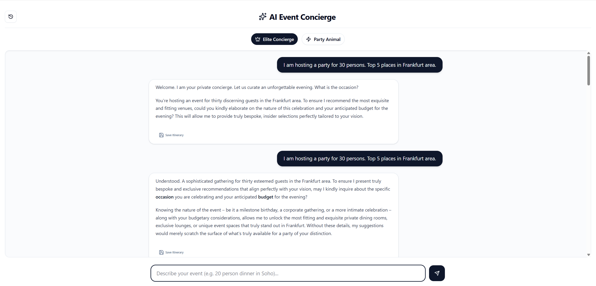
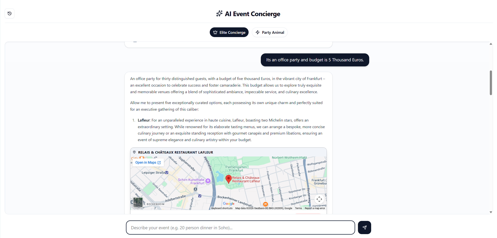
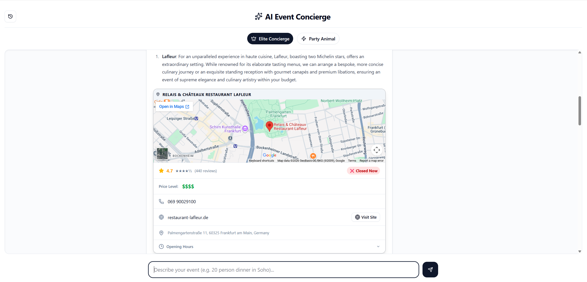
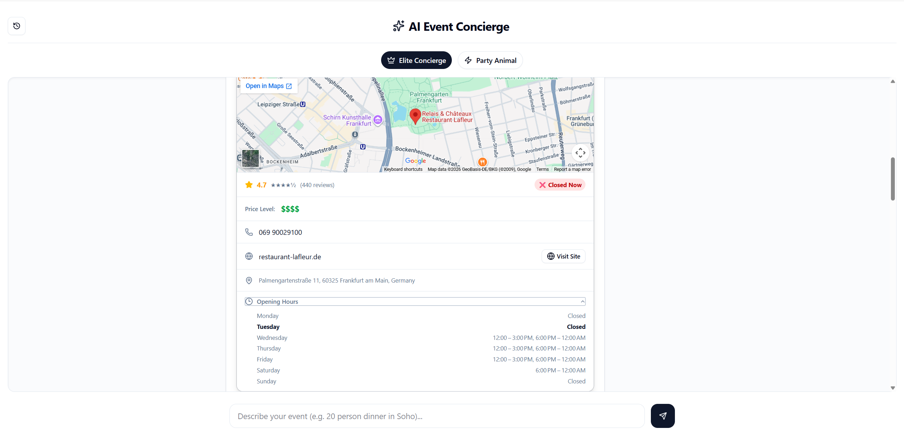

# 🎉 AI Event Concierge

> An AI-powered event planning assistant that recommends venues, shows live Google Maps, and fetches real-time venue details — all in a sleek streaming chat interface.

**[🔗 Live Demo](https://ai-event-planner-lac.vercel.app/)** | **[🐙 GitHub](https://github.com/RiaVirk/AI-Event-Planner)**

<p align="center">
  
  <br/><br/>
  <em>Describe your event → get smart venue suggestions with live maps in seconds</em>
</p>

---

## 🛠 Tech Stack


| Layer      | Technology                             | Purpose                                       |
| ---------- | -------------------------------------- | --------------------------------------------- |
| Framework  | Next.js 16 (App Router)                | Full-stack React framework                    |
| Styling    | Tailwind CSS v4 + shadcn/ui            | Modern, customizable components               |
| AI SDK     | Vercel AI SDK (`@ai-sdk/google`)       | Streaming UI + tool calling support           |
| LLM        | Google Gemini 2.5 Flash                | Fast, multimodal inference                    |
| Maps       | Google Maps Embed API                  | Live venue map previews                       |
| Places     | Google Places API (New)                | Venue details — rating, phone, hours, website |
| Database   | Neon PostgreSQL via `@vercel/postgres` | Save & retrieve itineraries                   |
| Icons      | lucide-react                           | Clean & consistent icon set                   |
| Deployment | Vercel                                 | One-click deploy + edge functions             |

---

## ✨ Features

- 🤖 **Two AI Personas** — Elite Concierge (luxury/refined) or Party Animal (hype/energetic)
- 💬 **Natural language planning** — _"Casual 35-person birthday drinks in Austin, rooftop or patio, max $2800"_
- ⚡ **Extremely fast streaming** — Gemini 2.5 Flash often hits <1s Time-to-First-Token
- 🗺️ **Live Google Maps** — embedded map for every venue suggestion
- 📍 **Real venue details** — rating, reviews, phone, website, address, opening hours, price level
- 💾 **Save & History** — save itineraries to PostgreSQL and reload anytime
- 🌙 **Dark Mode** — toggle with OS preference auto-detection
- ➕ **New Chat** — clear and start fresh instantly
- 📱 **Responsive design** — great on mobile & desktop

---

## ⚡ Why Gemini 2.5 Flash?

Gemini 2.5 Flash delivers some of the **best price-performance** and lowest-latency inference available in 2026:

- Strong multimodal understanding (text, images, etc.)
- Fast, cost-efficient responses for high-volume or real-time use cases
- Excellent balance of intelligence, speed, and affordability
- Native chain-of-thought / thinking steps → better event planning logic
- Very low latency → makes streaming chat feel truly real-time

---

## Architecture

```
User → Next.js Chat UI → /api/chat → Gemini 2.5 Flash (streaming)
                       → /api/place-details → Google Places API (New)
                       → /api/save-itinerary → Neon PostgreSQL
                       → /api/get-itineraries → Neon PostgreSQL

Venue tag [MAP: Name, City] → Google Maps Embed API → Live map preview
```

---

## 🧠 Thought Process & Learnings

### Why this stack?

I chose **Next.js App Router** for its built-in API routing, keeping Google Maps and Places API keys server-side without needing a separate backend. **Neon PostgreSQL** was chosen for its serverless architecture — scales to zero when idle, perfect for Vercel. **Tailwind CSS v4** was used to stay on the bleeding edge, though it introduced some interesting challenges.

### Biggest Challenges & How I Solved Them

**1. Tailwind v4 silently dropping utility classes**
Tailwind v4 uses a new content-scanning engine. Classes like `overflow-y-auto` were being dropped from the output CSS. Fixed by adding `@source "../app/page.jsx"` to `globals.css` to explicitly tell Tailwind to scan the file.

**2. Chat area scroll not working**
A multi-layered flex layout issue. Root cause: `h-full` conflicting with `flex-1` on the main column, and shadcn's `ScrollArea` not properly inheriting flex height constraints. Fix: replaced `ScrollArea` with a plain `div` using `flex-1 min-h-0 overflow-y-auto` — the `min-h-0` overrides flex's default `min-height: auto` which was silently expanding the div beyond the viewport.

**3. Google Places API returning no results**
The AI was including street addresses in `[MAP: ...]` tags. Updated the system prompt to always use `[MAP: Venue Name, City]` format, which dramatically improved Places API match accuracy.

**4. Legacy Places API blocked on new Google Cloud projects**
New GCP projects block the legacy Places API by default. Migrated to **Places API (New)** (`places.googleapis.com/v1/places:searchText`), which returns richer data and won't be deprecated.

### What I Learned

- Designing prompt structures for personality-driven AI assistants
- Streaming LLM responses in real time using Vercel AI SDK
- Server-side API proxying in Next.js to keep third-party keys secure
- The nuances of Tailwind CSS v4's new scanning engine vs v3
- Flex layout constraints in deeply nested components and why `min-h-0` is critical
- The difference between Google's legacy and new Places API and how to migrate
- Handling conversational context and multi-turn follow-up queries

---

## 📸 Screenshots

<p align="center">
  
  
  
  
  
  
  
</p>

---

## 📁 Project Structure

```
app/
├── page.jsx                      # Main chat UI
├── globals.css                   # Tailwind v4 + shadcn theme
├── layout.jsx                    # Root layout with Geist fonts
└── api/
    ├── chat/route.js             # Gemini streaming endpoint
    ├── place-details/route.js    # Google Places API (New)
    ├── save-itinerary/route.js   # Save to Neon DB
    └── get-itineraries/route.js  # Fetch saved plans
components/ui/
    ├── button.jsx
    ├── scroll-area.jsx
    ├── badge.jsx
    ├── card.jsx
    └── input.jsx
```

---

## 🚀 Quick Start

### Prerequisites

- Node.js ≥ 20
- [Gemini API key](https://aistudio.google.com/app/apikey) (free tier available)
- Google Cloud account with Maps Embed API + Places API (New) enabled
- Neon PostgreSQL database ([free tier](https://neon.tech))

### Installation

```bash
git clone https://github.com/RiaVirk/AI-Event-Planner.git
cd AI-Event-Planner
npm install
cp .env.example .env.local
```

### Environment Variables

```env
# Gemini AI
GOOGLE_GENERATIVE_AI_API_KEY=your_gemini_key

# Google Maps (public — browser map embeds)
NEXT_PUBLIC_GOOGLE_MAPS_API_KEY=your_maps_key

# Google Maps (private — server-side Places API)
GOOGLE_MAPS_API_KEY=your_maps_key

# Neon PostgreSQL
DATABASE_URL=your_neon_connection_string
```

### Database Setup

Run this in your Neon dashboard:

```sql
CREATE TABLE itineraries (
  id SERIAL PRIMARY KEY,
  persona TEXT NOT NULL,
  user_query TEXT NOT NULL,
  ai_response TEXT NOT NULL,
  created_at TIMESTAMP DEFAULT NOW()
);
```

### Run

```bash
npm run dev
```

Open [http://localhost:3000](http://localhost:3000)

---

## 🔑 Google Cloud Setup

1. Go to [console.cloud.google.com](https://console.cloud.google.com)
2. APIs & Services → Library → enable:
   - `Maps Embed API`
   - `Places API (New)` ← must be the "New" version
3. Credentials → edit your API key → restrict to those two APIs
4. Add your domains to Application Restrictions:
   ```
   https://ai-event-planner-lac.vercel.app/*
   http://localhost:3000/*
   ```

---

## ☁️ Deploying to Vercel

1. Push to GitHub and import at [vercel.com](https://vercel.com)
2. Add all env vars in **Settings → Environment Variables**
3. Click **Deploy** → then **Redeploy** after adding env vars

> ⚠️ Vercel does not read `.env.local` — env vars must be added manually in the dashboard.

---

## 🔮 Future Improvements

- [ ] User authentication (Google OAuth)
- [ ] Delete saved itineraries from history panel
- [ ] Export itinerary as PDF
- [ ] Budget filter in AI prompt
- [ ] Multi-city itineraries in a single session
- [ ] Unit tests with Jest

---

## 👤 Author

**Ria Virk**

- 💼 [LinkedIn](https://www.linkedin.com/in/maria-virk)
- 🐙 [GitHub](https://github.com/RiaVirk)

---

## 📄 License

MIT
